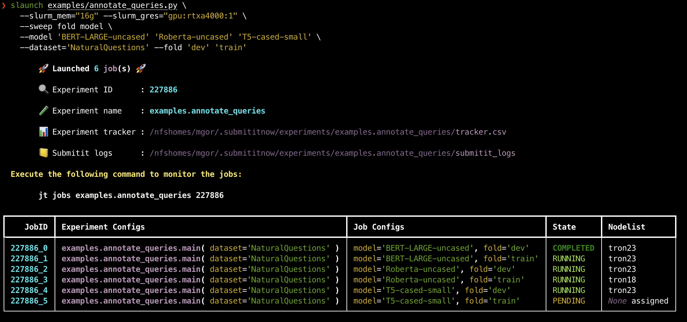
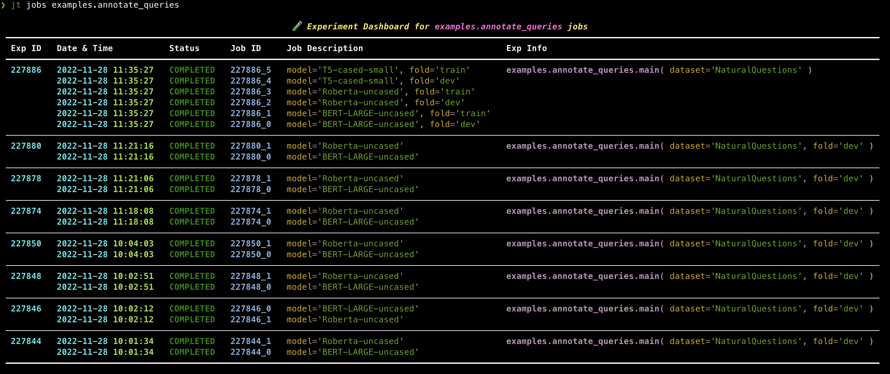
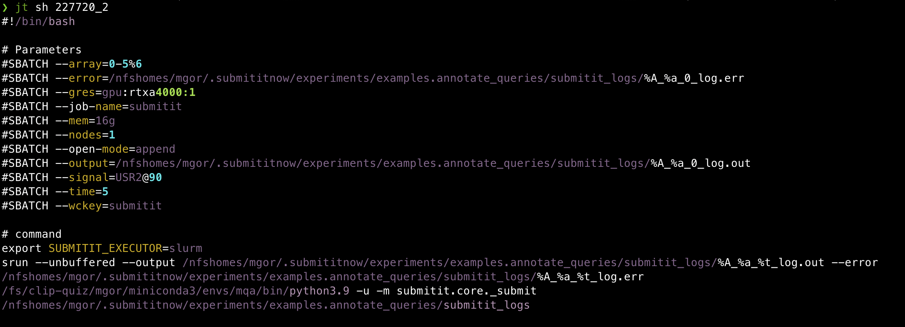

# :rocket: Submit it Now! :rocket:

&nbsp;
&nbsp;[](https://github.com/psf/black)
&nbsp;[](https://pypi.org/project/rich/)
&nbsp;[](https://twitter.com/maharshigor)


A _makeshift_ toolkit, built on top of [submitit](https://github.com/facebookincubator/submitit), to launch SLURM jobs over a range of hyperparameters from the command line. It is designed to be used with existing python scripts and interactively monitor their status.


__`submititnow` provides two command-line tools:__
* `slaunch` to launch a python script as SLURM job(s).
* `jt` (job-tracker) to interactively monitor the jobs.

__It also provides an abstracted [`experiment_lib.Experiment`](submititnow/experiment_lib.py#L16) API to create, launch and monitor an experiment, or a group of job(s), from python scripts with customized parameter-sweeping configurations, while being able to track them with `jt`.__

## `slaunch` : Launching a python script over SLURM

Let's say you have a python script [`examples/annotate_queries.py`](examples/annotate_queries.py) that can be run using following command:

```bash
python examples/annotate_queries.py --model='BERT-LARGE-uncased' \
    --dataset='NaturalQuestions' --fold='dev'
```
You can launch a job that runs this script over a SLURM cluster using following:
```bash
slaunch examples/annotate_queries.py \
    --slurm_mem="16g" --slurm_gres="gpu:rtxa4000:1" \
    --model='BERT-LARGE-uncased' --dataset='NaturalQuestions' --fold='dev'
```

### __Launching multiple jobs with parameter-sweep__

```bash
slaunch examples/annotate_queries.py \
    --slurm_mem="16g" --slurm_gres="gpu:rtxa4000:1" \
    --sweep fold model \
    --model 'BERT-LARGE-uncased' 'Roberta-uncased' 'T5-cased-small' \
    --dataset='NaturalQuestions' --fold 'dev' 'train'
```
This will launch a total of 6 jobs with following configuration:



### __Any constraints on the target python script that we launch?__
The target python script must have the following format:

```python
import argparse

# User defined functions and classes

def main(args: argparse.Namespace):
    # Code goes here
    pass


def add_arguments(parser = None) -> argparse.ArgumentParser:
    parser = parser or argparse.ArgumentParser()
    # Return the parser after populating it with arguments.
    return parser


if __name__ == '__main__':
    parser = add_arguments()
    main(parser.parse_args())

```

## **`jt`** : &nbsp; Looking up info on previously launched experiments:

As instructed in the screenshot of the Launch response, user can utilize the `jt` (short of `job-tracker`) command to monitor the job progress.

### **`jt jobs EXP_NAME [EXP_ID]`**

Executing `jt jobs examples.annotate_queries 227720` will give following response:


In fact, user can also lookup all `examples.annotate_queries` jobs simply by removing the `[EXP_ID]` from the previous command:
```
jt jobs examples.annotate_queries
```


### **`jt {err, out} JOB_ID`**
__Looking up stderr and stdout of a Job__

Executing `jt out 227720_2` reveals the `stdout` output of the corresponding Job:


Similar is case for `jt err 227720_2` which reveals `stderr` logs.

### **`jt sh JOB_ID`**
__Looking up SLURM SBATCH shell file of a Job__

submitit tool internally create an SBATCH shell script per experiment to launch the jobs on SLURM cluster. This command helps inspect this `submission.sh` file.

Executing `jt sh 227720_2` reveals the following:



### **`jt ls`**
Finally, user can use `jt ls` to simply list the experiments maintains by the `submititnow` tool.


Outputs of this command can be further used to interact using `jt jobs` command.

## __Installing__
Python 3.8+ is required.

```bash
pip install -U git+https://github.com/maharshi95/submititnow.git
```

## **Experiment API:**
Sometimes `slaunch` command-line tool is not enough. For example, one may want to launch a job with customized parameter-sweep configurations, or have a certain parameter (e.g. `output_filepath`) different for each job in the launch. In such cases, one can use the Experiment API provided by `submititnow` to launch jobs from python scripts and also get the benefits of being able to track them with `jt`.

[examples/launch_demo_script.py](examples/launch_demo_script.py) provides a demo of how to use the `Experiment` API to launch a job with customized parameter-sweep configurations.
```bash
python examples/launch_demo_script.py
```
## **Experiment API:**
Sometimes `slaunch` command-line tool is not enough. For example, one may want to launch a job with customized parameter-sweep configurations, or have a certain parameter (e.g. `output_filepath`) different for each job in the launch. In such cases, one can use the Experiment API provided by `submititnow` to launch jobs from python scripts and also get the benefits of being able to track them with `jt`.

[examples/launch_demo_script.py](examples/launch_demo_script.py) provides a demo of how to use the `Experiment` API to launch a job with customized parameter-sweep configurations.